# Project 3 - Animals' Facts

## Description

Project 3 is creating a full stack app and designing our own API for it.
During the course we have just been taught how to create a backend/API in Express and how to link it to our frontend.
This project is to review what we learnt about fullstack and applying skills from previous weeks including CSS and JavaScript.
The app created is an animal fact finder page which has information of all types of animals including their conservation status and how to help protect them. It also has a community page where people can talk about their favourite animals with others.

## Deployment Link

[Animals' Facts](https://animalsgonewild.netlify.app/)

## Getting Started

To get this project up and running on your local machine, follow these steps:

For the backend:

1. Clone the repository: git clone git.github.com: hoenigma/seb-project-3.git
2. Install the packages: npm i
3. Run the seed to get the database started: npm tsc && node dist/db/seed.js
4. Run the backend: npm run dev

For the frontend:

1. Clone the repository: git clone git.github.com: hoenigma/seb-project-3.git
2. Install the packages: npm i
3. Run the frontend: npm run dev

## Timeframe & Working Team

Project 3 was a group project where I worked with Elizabeth Talbot and Syed Siddiqui.
We had one week to complete this project.

## Technologies Used

### Backend:

- Express
- MongoDB: mongod and mongoose, for the database and connecting to it
- Unique-Validator
- JSON Web Token, to create a token for a user login
- Bcrypt, encrypt password
- Node.js
- TypeScript

### Frontend:

- React
- Axios
- Bulma
- Vite
- Font Awesome
- TypeScript

## Brief

The brief for this project was to build a MERN (Mongoose, Express, React, Node) stack app. The requirements for this project were:

- Use git to code collaboratively
- Build a full stack app
- An Express API with mongoose on a Mongo database
- Create a separate front-end in React
- Be a complete product-multiple relationships and CRUD functionality
- Implement thoughtful user stories/wireframes
- Deploy online
- A **working app** hosted on the internet
- A **link to your hosted working app** in the URL section of your Github repo
- A **git repository hosted on Github**, with a link to your hosted project, and frequent commits dating back to the very beginning of the project

## Planning

### Non-Memeber View

**Home Page**, a hero section with text, a background image and a navbar that’ll go on all pages.

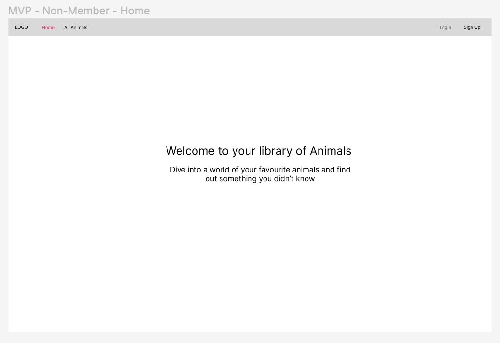

**List of all animals**, a page which will hold all the animals on the database on little cards. The information shown will be an image, name, type of animal (this would be Land, Sea and domestic), a did you know fact and a link to the show animal to find out more. A search bar will be added as well.

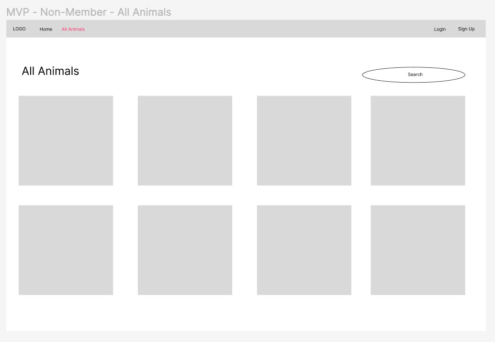

**Show Animal**, when the user clicks on a card above the show animal page shows below.
This has a few more pieces of data including the conservation status.
In the planning, it was decided to include and emphasise conservation status as a main feature of the app to show people how endangered their favourite animal is.

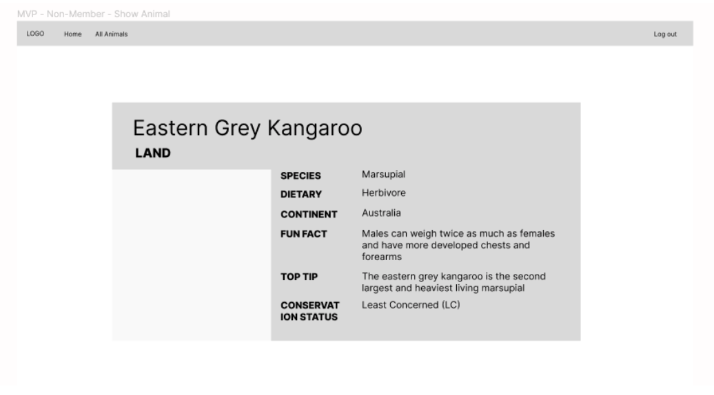

**Sign up**, for a non-member to sign up they would have to make a username, email, password and match it in confirmation password. When they click the sign up button it will take them to the login page.

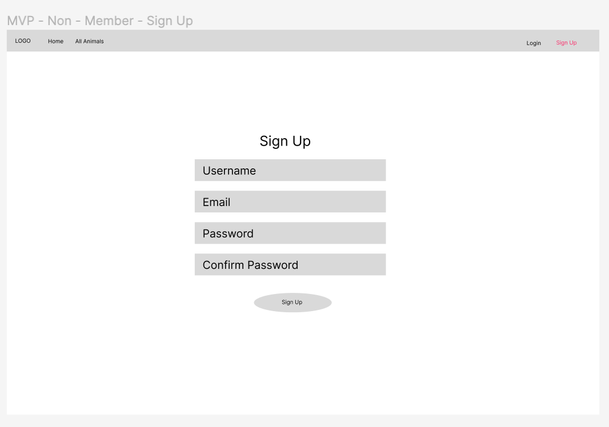

**Login**, the user will need to put in their email and password to login and get the Member experience of the app.

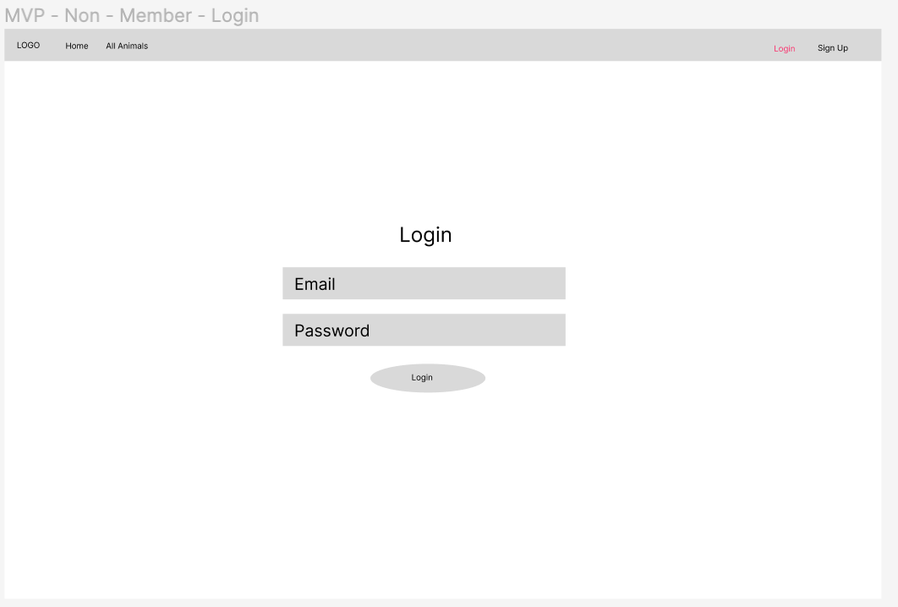

### Member View

**Home**, after login the user will be taken back to the home page where they will be greeted with a welcome message. In the navbar the signup/login has changed to a log out.

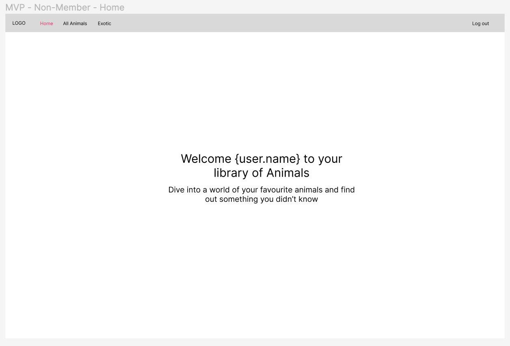

**All Animals**, same as the non-member view but there is now a button to add an animal.

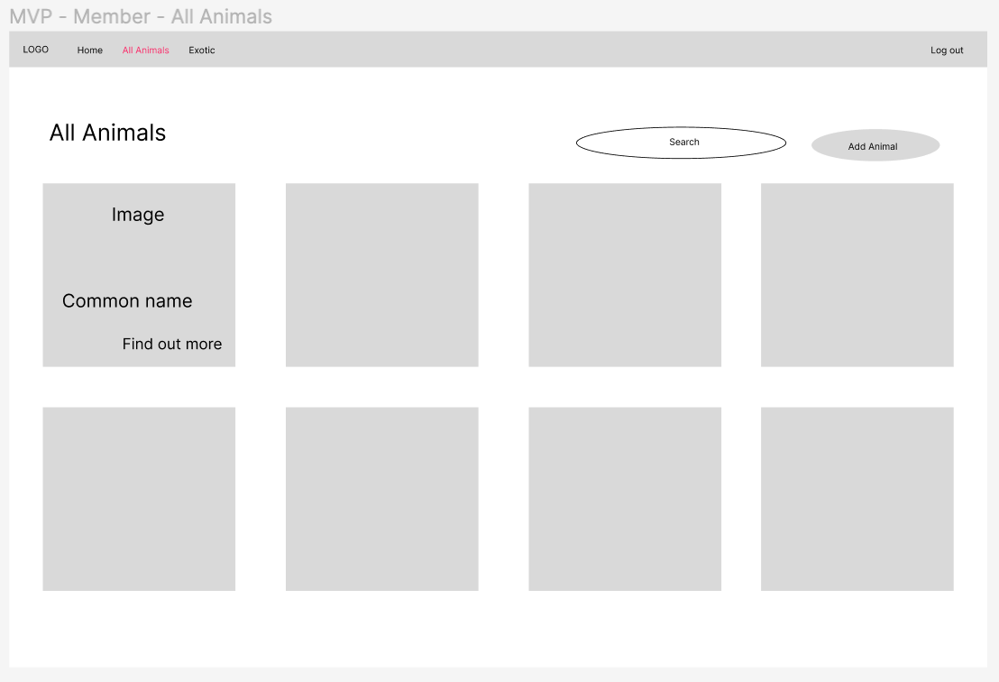

**Add Animal**, the user has fields they have to fill in to create an animal. We decided to give certain fields a drop down menu to limit the options for the user. Conservation Status can only be a set amount of options and type has to be limited for a filter function.

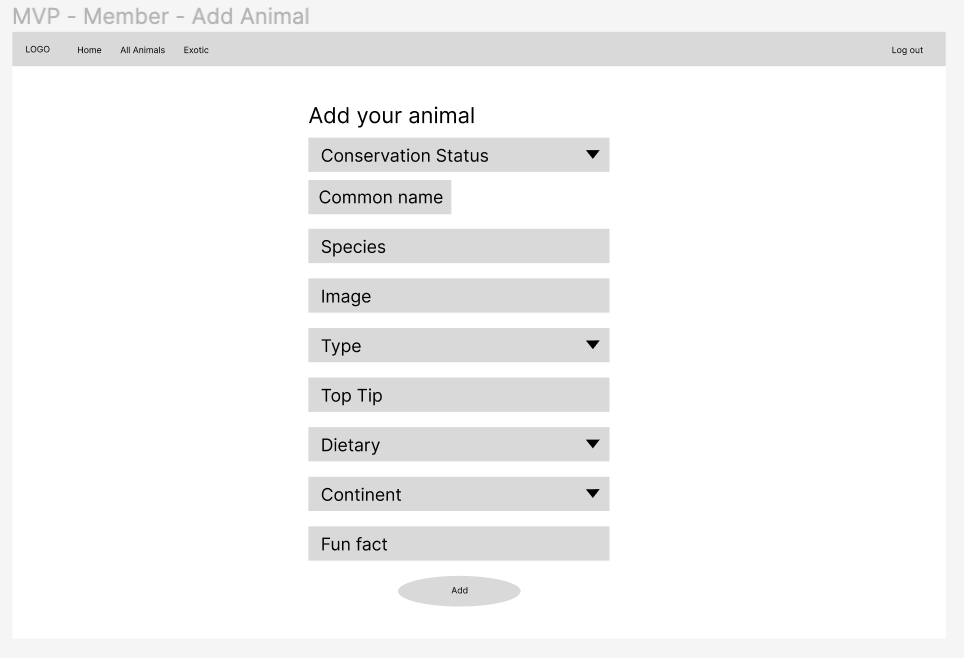

**Show Animal**, the show animal is the same but includes some new buttons. If the member has created the animals page (from add animal above) they will be able to see an update animal button and a delete button.
The update animal page has the same look as the add animal page.
As a member, they will see a community button on each of the show animal pages. This will be on no matter if they created that animal or not.

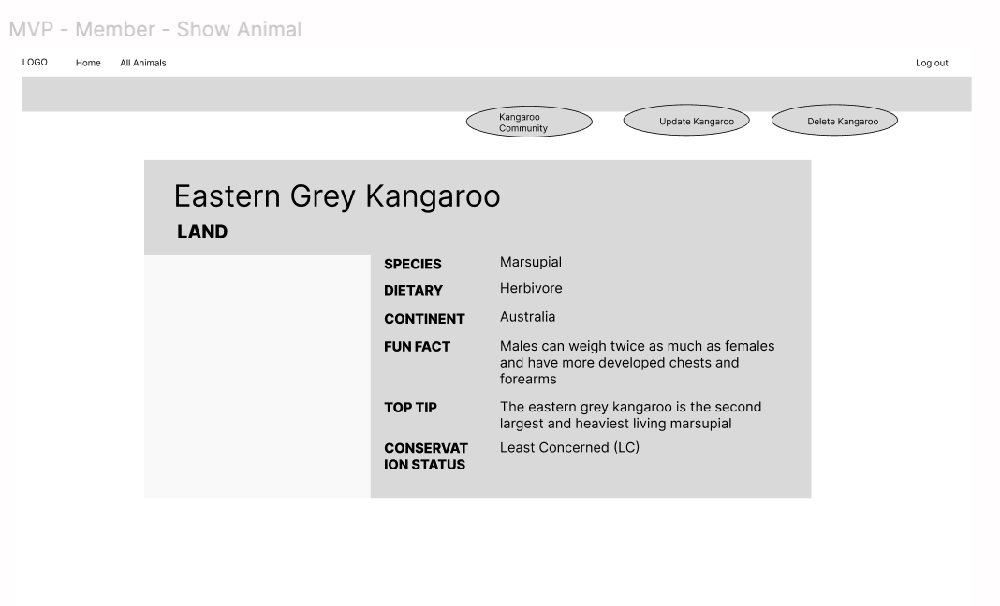

**Community Page**, clicking on the community page will take the user to a blogging-like page where they can add their own posts and delete ones they created. User will need a title and a comment, date and time is also needed but will try to make this automatic so the user won't have to fill it in. Each animal will have its own page with its own comments.

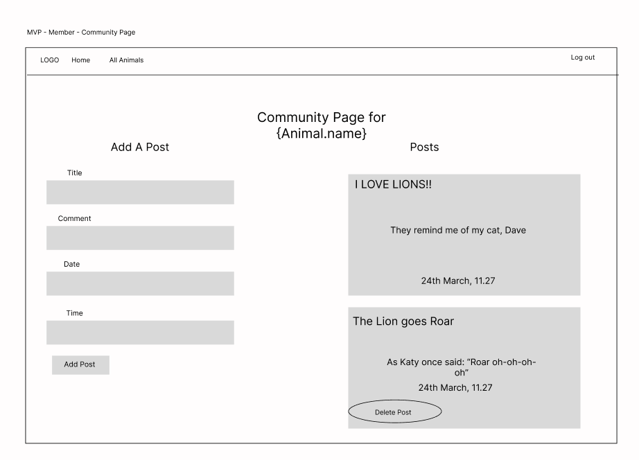

When discussing how to manage our time, we decided to use a Trello Board to get an idea of what we had to do.

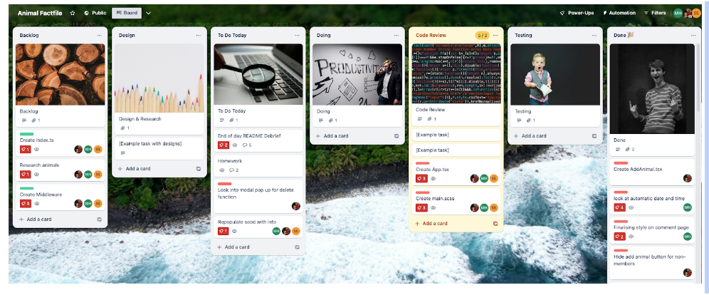

On the board, we would create tiles each day on what we had to do and assign the specific person to that tile. Once a person finished, they would move it to the code review tab for the others to check and once checked moved into the done tab.

At the start of the project, we would all work together in a paircode like way to create root files including the App.ts, Schema’s for each model, deciding what components are needed and much more (see Build/code Process for more details)

For solo work, I was given the responsibility of creating a function in the back end for login, signup, update animals and delete animals. I was also given the task to create the community page in both the back-end and front-end.

## Build Process

### Day 1

The start of the project was creating the wire framing and plan for the week (see above for more details). We then started in the backend setting up the files that will be needed to get functions in the backend working (get, delete, put and post).
The first file to create was the index.ts and connect the backend to a database in MongoDB.
Then the Router was boilerplate with all the functions we wanted to make and connect them to the app. This helped to keep us guided in what we had to add to the app.
Schema’s were then created for Users, Animals and Comments. For the user, hashing password via Bcrypt was added and a comparing password function was added.

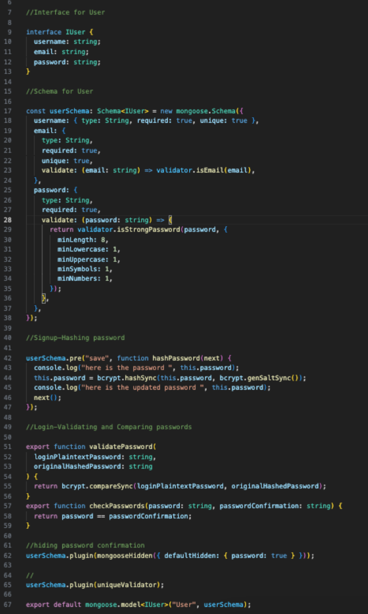

### Day 2

The start of day 2 was setting up the front end by creating the vite.config.ts to connect to the backend. We then split up the work to start getting a functioning backend and showing the information on the frontend.
I was given the task to create the get animals, get one animal and create an animal function in the backend and show all the animals in the frontend. Once I created a backend function, I would test it on insomnia to make sure it was all working.
In the frontend, I had to create a useState for the animals with an interface for the animals so the TypeScript would work. This useState was used with the fetch function to get the data from the backend and database. I then created an Animal Card function to get the animal displaying on the list page with basic information of name, image, fun fact and a link to the show animal page.

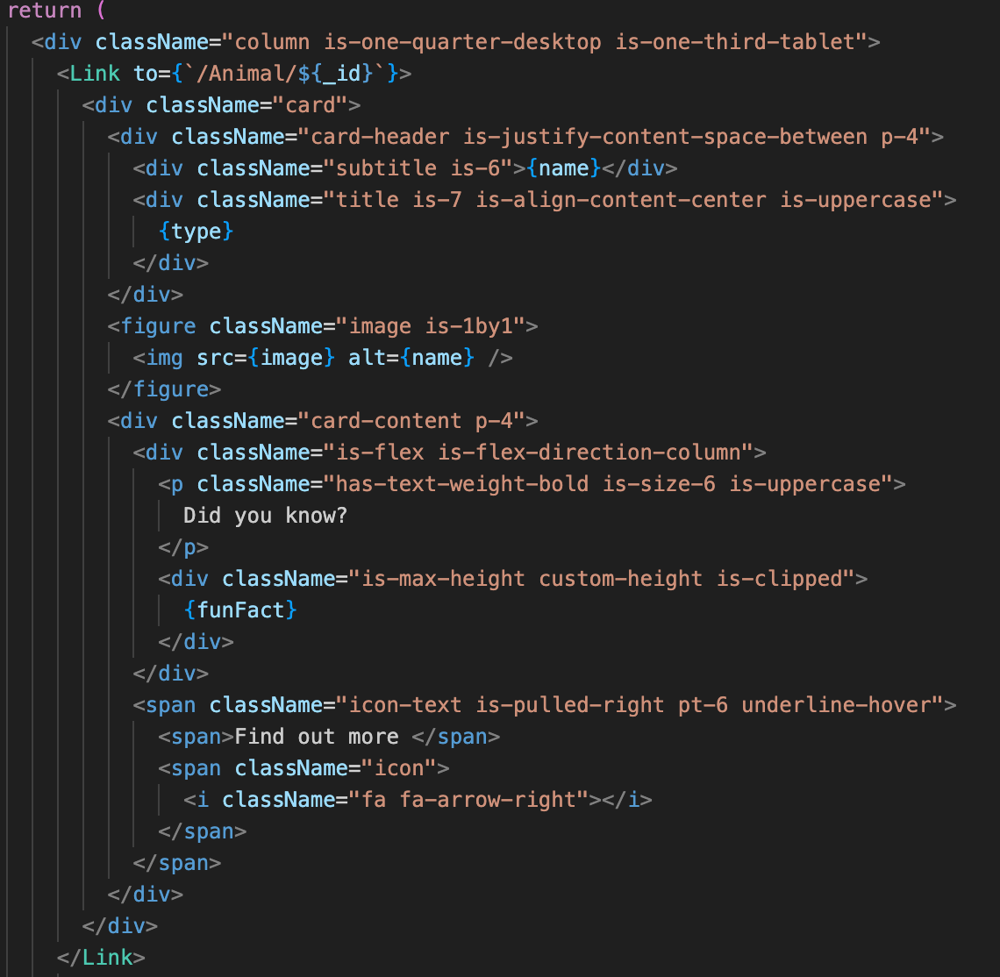

### Day 3

On day 3, I started by creating the backend for signup and login in userController. In the login, I had to create a token for the user using jsonwebtoken so they can have access to other features on the app. After this, I went through the delete animal and update animal functions to check over my colleagues work and fixed some issues on those functions.

The rest of the day, I created the comment controller in the backend and the functions that went with it. For adding a post I had to link the user and animal Id as I wanted the comments to link to a certain animal and only show for that animal. This would be received from the URL via req.params. The user is received from the secureRoute file using res.locals.currentUser, this is so the post has a user attached and can delete the post.
With the show comment function I had to only show the comments that were related to the animal Id. Again this was found by the req.params.
A delete function was also created and had a check to make sure only the user who created the post could delete it.

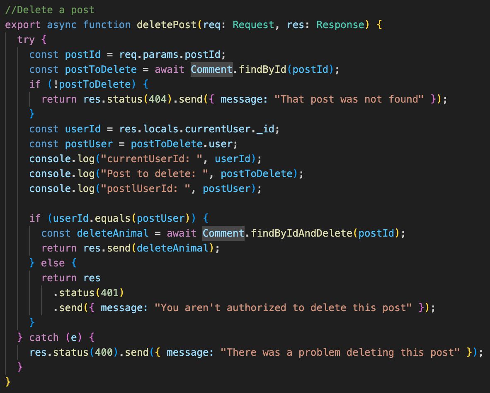

An update post function was created and worked in the backend, but unfortunately there wasn’t enough time to put this in the front end.

### Day 4

As all the comments function was completed in the backend, I then went to work on the frontend for this. Firstly, I created an interface for the comments making all the types a string
and I added a post function by creating a form. This was done by creating a formData usestate with the values set to an empty string.

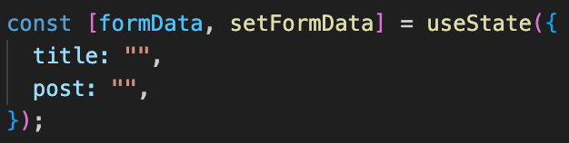

I then created a function to handle the information put into the form as a handle change function. This was achieved by targeting the fields via e.target.name which is put into the input class in the JSX:

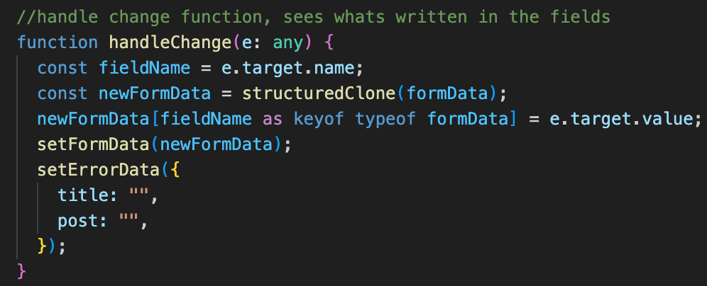

The formData is then cloned so it can be edited from the e.target.value

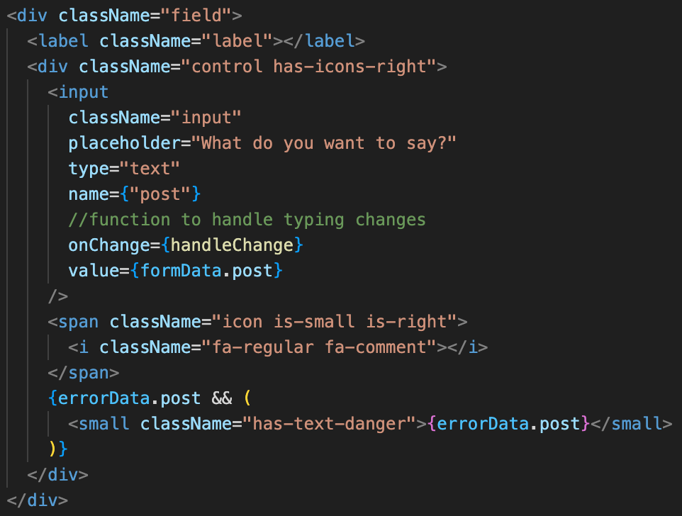

I then had to create a handleSubmit function to send the data put into the form into the database.
This was done using an axios.post function and linking the URL to the one in the backend. The token from the login is also added to this so the user can delete the post.

At the end of the function it will navigate back to this page to refresh it and show the comment via the fetch comments function:

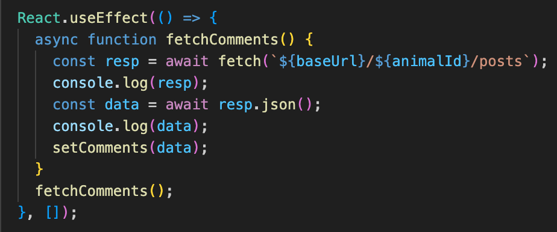

A delete comment function was also added to the front end.

With the form created, I moved onto displaying the comments.

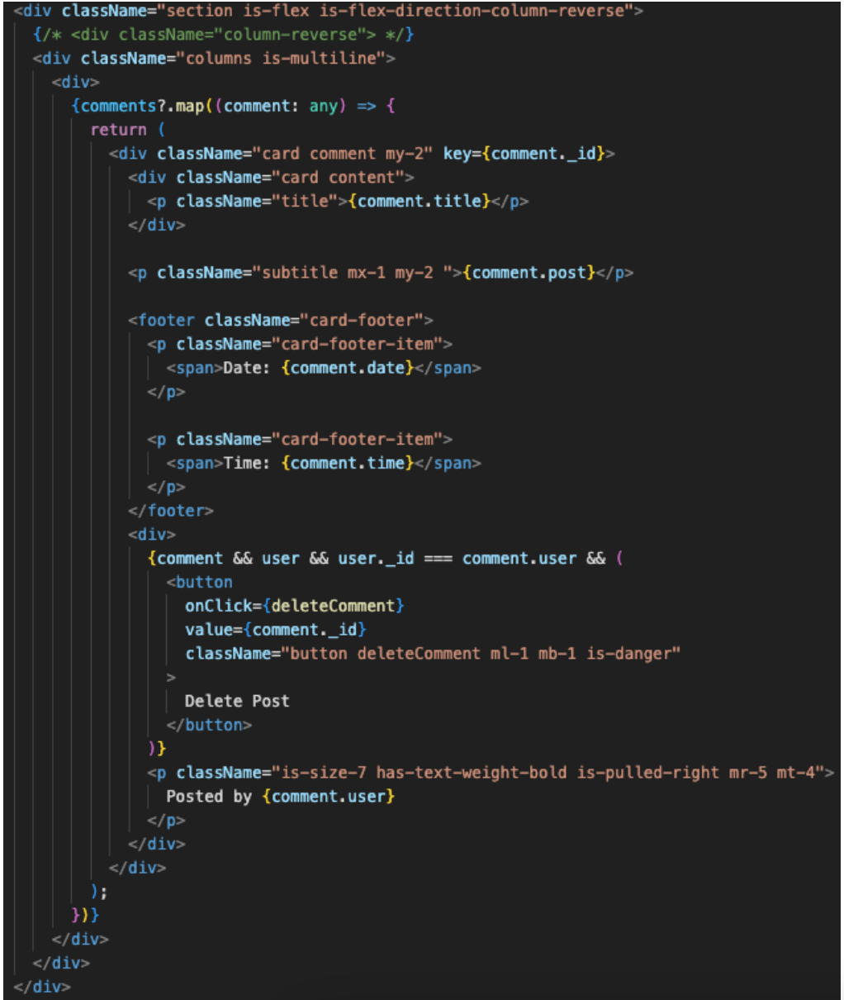

This was done using the map function and displaying by using comment.variableName. A delete button was also added but would only show for the user who created the post.

### Day 5

Day 5 was spent helping on the update animal function. If on the update animal form you didn’t fill in all the fields, it would update that field as an empty string. To fix this we would firstly fetch the data from that animal and set it to the form data using setFormData. This meant when the update form paged appeared, it would be pre populated and the user could then choose what they wanted to update.

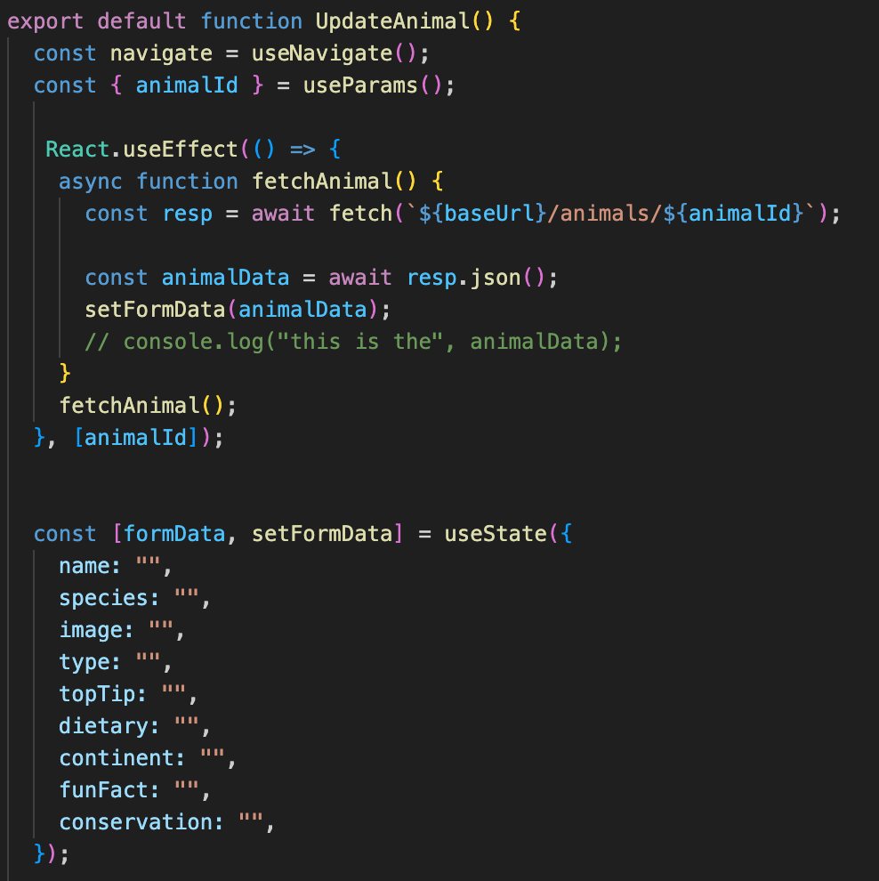

I then spent a bit of time going through all the pages and checking the non-member/member view was working.
After that, I went back to the comments page to add an automatic time and date to the posts so the user didn’t have to fill it in themselves. I then styled the comments page so the form was matching the other forms and the comments looked nice on the page.

### Day 6

The last day was spent deploying our website to the web. Firstly, the database was put from the MongoDB on my local drive into Mongo Atlus in the cloud.
The backend and frontend were deployed via netlify and some code had to be changed to accommodate the connection between each other and the database.
In the backend I had to change the connection from the local mongoDB to the cloud and added a couple more files for this to work.
In the frontend, we had to update all our paths from /api to the URL we created for the backend. Firstly we had to import a link to the back end via Vite, add some code to fix the errors and then change every link from api/animals (etc) to `${baseURL}/animals.

## Challenges

For the community page each animal would have its own posts attached to it. To show all the posts made I had to use the .find function in express but doing this would return every comment made in the database, not just the ones for that animal. After some trials and googling, I found that using .find({animalId : animalId}) would find and show all the comments with the animalId from the params. To make sure the animal Id was in the URL for the Params to work, I modified the link in the router to be: router.route("/api/:animalId/posts").

When a post is created, it needs to be given the animal Id from where it was clicked. Using what we learnt about inserting the user by creating the variable req.body.user, I did the same by creating a req.body.animalId and got this from the URL via the params.

Another challenge I had was in the update animal component. My colleague who was working on it couldn’t understand how to get the function to work so I offered to help by paircoding with him showing me the code on the screen. The first problem noticed was in the back end, the animalId wasn’t connected properly and needed to be given req.params.animalId. This was checked in the backend via insomnia and we confirmed it worked.
In the front end, we had the problem of if you don’t type in every field it would update the animal with empty fields. After some googling and experimenting with the useState starting state, I found a way to insert the data from the show animal page into the update animal page using a useEffect and fetch function to grab the data of the animal from its animalId. The useEffect meant when the page first loads it will have the data from the animalId in the form and the user could now update whatever field they like with the others staying the same.

## Wins

One win was working out how to give the comments an automatic date and time so the user wouldn’t have to type this in. I haven’t come across this before so I had to google how to do this and discovered Date.now(), new Date(ts) and .getDate etc. The Date.now grabs the date and time, the new Date(ts) changes the timestamp to ms and the getDate, getMinutes and getHours functions get the date, minutes and hours respectively.
The code below shows how this was written.

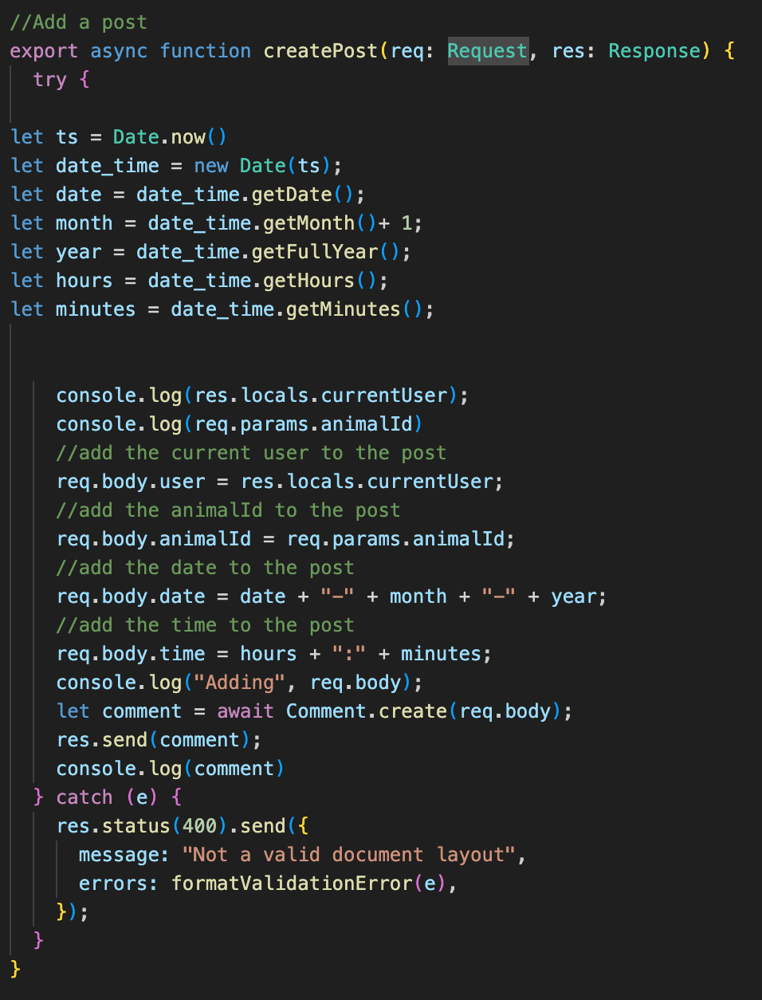

I then put this into the post using req.body. One challenge from this was working out where to put the variables. If they were outside the function, it wouldn’t update unless you had a set interval. But when put in the function it would get the time everytime the add post function was requested.

Designing the comments page was a personal win for me due to my improvement of using Bulma. After creating the functionality, I followed my design from the framework to create the form to post and the little cards for where the posts would go. Using the class of flexbox, I was able to get the posts on the other side of the form.

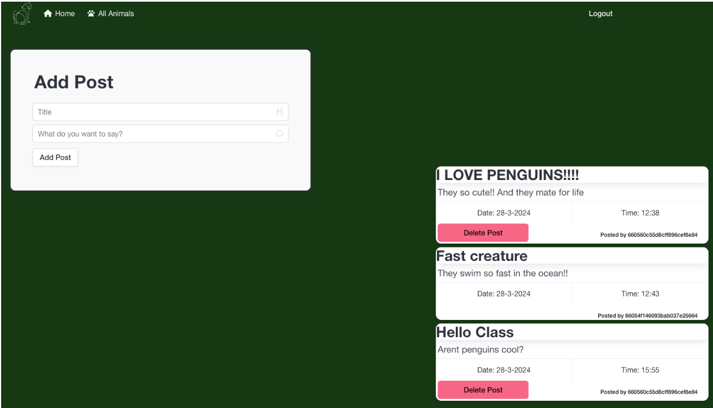

Another win for me was further understanding how Git worked and the importance of it in a group project. I was able to help my other colleagues with pushing their code and deciding what we would merge together. It showed me why in a professional setting it is important to do this and the more often it is done the easier mergers are.

## Key Learnings

Working in a project and doing different codes at the same time got me more comfortable with using Git and how to merge all our work together. After the first day, I was helping the rest of my team with the steps of merging and guiding them through the steps whilst they shared their screens. The merging of our codes was also done by screen sharing and checking we were happy with what would be on the GitHub Repo.

I found myself taking a leadership role in the project which I haven’t had much experience in in other projects. Using my skills from previous jobs, I was able to help guide my team into what was the most important tasks to do first and create a plan each day. If they needed a hand, I would be very happy to help guide them to a solution and make sure they understood what happened in the code.

This was the first project I used Trello Board to plan and manage the project on.
Thanks to the help of Elizabeth who had experience on Trello before, I learnt what was the best way to utilise this and how to let others in my team know what I have done and what needs checking. I will definitely be using this in the future in a group project.

Using Bulma for the second time, I had a bit more familiarity with it but still had a lot to learn. Deciding to style then comment on my own was a good challenge to apply what I have learnt and create a page I was happy to show. I also learnt a lot from Elizabeth with her knowledge of Bulma and got her to talk me through what she created and showed why it worked.

## Bugs

App is not adapted to smaller screens. Would need to add some media enquiries and max-widths to adapt this.

## Future Improvements

- If we had more time, it would have been fun to add a modal for the delete button. - This would give a user a double check before deleting their animal/comment.
- Adding replies to people’s comments to keep conversations to make it more of a community feel.
- A super admin for the website that can delete/update any animal or post.
- On the community page if there was more time the username could have been added to each post rather than the ID.
